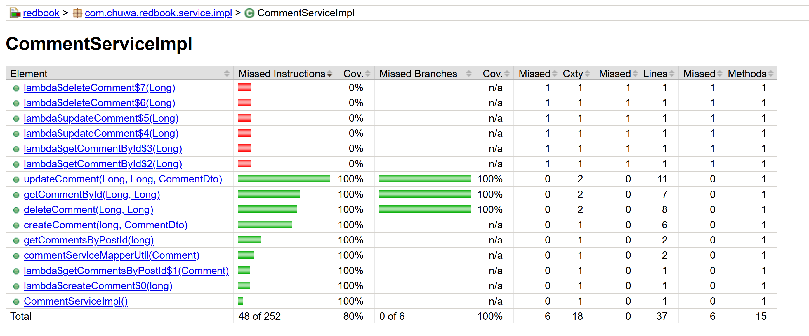

# Testing Types #
## 1.Unit Testing ##
- Test a single funciton/class in isolation.  
- White box testing business logic, has to be conducted by developers themselves.
- JUnit, Mockito
```java
@Test
void testGetAllPost() {
    //...
    Mockito.when(mockedModelMapper.map(ArgumentMactchers.any(Post.class), ArgumentMatchers.eq(PostDto.class))).thenReturn(postDto);
    Mockito.when(postRepositoryMock.findAll())
            .thenReturn(posts);
    
    List<PostDto> postDtos = postService.getAllPost();
    //...
}
```
Does not call a real DB, mock posts and mock mapper to postDtos.  
Only focus on postService.getAllPost() business logic

## 2.Functional Testing ##
- Test a feature against requirements (Black Box Testing)
- One function from user perspective
- Focus on Input -> Output correctness

Does not care about internal code, Assertions.assertEquals().  
Result is all you need.

## 3.Integration Testing ##
- Test multiple components working together
- Service + DB, API + Repository
```java
@SpringBootTest
class PostServiceIntegrationTest() {
    @Auotiwred
    private PostServiceImpl postService;  // real post service
    
    @Autowired
    private PostRepository postRepository;
    
    @Autowired
    private ModelMapper modelMapper;
    
    @Test
    void testGetAllPost() {
        List<PostDto> postDtos = postService.getAllPost();
    }
}
```
Spring Boot test hitting real DB, verifies:
- JPA mappings
- SQL queries
- API ↔ DB interaction

## 4.Regression Testing ##
- Re-run existing tests after changes.  
- Ensure new code did not break old features.

## 5.Smoke Testing ##
- Quick basic test to check build is stable
- After deployment

## 6.Performance Testing ##
- Check RPS

## 7.Stress Testing ##
- Push system beyond limits
- Find breaking point & recovery behavior

## 8.A/B Testing ##
- Compare two verions with real users
- Optimize business metrics

## 9.End-to-End Tesing
- Manually mock full user flow across system
- Slow but high confidence

## 10.User Acceptance Testing (UAT)
- Business users validate system meets requirements
- Run by product owners / clients

| Test Type   | Scope               | Speed   | Purpose               | Example           |
| ----------- | ------------------- | ------- | --------------------- | ----------------- |
| Unit        | Single method       | ⚡ Fast  | Logic correctness     | price calculation |
| Integration | Multiple components | ⚡⚡      | Component interaction | API + DB          |
| Functional  | Feature behavior    | ⚡⚡      | Meets requirement     | submit visa       |
| E2E         | Full workflow       | 🐢 Slow | Real user flow        | login → post      |
| Regression  | All tests           | ⏱️      | Prevent breakage      | run CI suite      |
| Smoke       | Very small          | ⚡       | Build sanity          | app boots         |
| Performance | Load within limits  | ⏱️      | Speed metrics         | 1k users          |
| Stress      | Beyond limits       | 🧨      | Breaking point        | 100k users        |
| A/B         | Real users          | 🧪      | UX optimization       | button color      |
| UAT         | Business validation | 🧑‍💼   | Acceptance            | HR approves       |

# Environments #

## 1.Developemtn ##
- Used by: Developers
- Data: Local / mock / test DB
- Purpose: Build features

## 2.QA Environment ##
- Used by: QA Engineers
- Data: Test data
- Purpose: Run test cases
Run:
- Functional tests
- Integration tests
- Regression tests

## 3.Pre-prod / Staging
- Used by: QA + Product + UAT
- Data: Production-like
- Purpose: Final Validation
Same DB type, same Kubernetes config, same environment variables
- E2E
- UAT
- Performance tests

## 4.Production ##
- Used by: Real users
- Data: Real customer data
- Purpose: To achieve high availability & reliability
Only safe tests allowed:
- Smoke tests
- Monitoring
- A/B testing

# CommentServiceImplTest #
