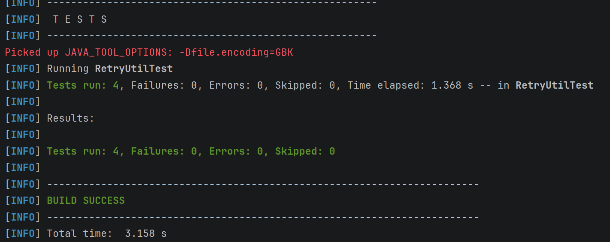

## When should you use multi-threading versus async/non-blocking I/O? Give specific examples of scenarios for each approach. ##
1. Multithreading
- Good for CPU-bound task;
- Examples: ecrypting, image compressing, large computation
- CPU is already fully utilized, async wont make computation faster

2. Async/non-blocking I/O
- Good for I/O-bound task;
- Examples: DB accessing, HTTP requests
- Most of the task time is waiting, thread IDLE, waste of resource using multi-threading

## What are Virtual Threads in Java 21? Explain how they differ from platform threads and when you should (or should not) use them. ##
Virtual threads are lightweight threads managed by the JVM. They let you write normal "blocking-style" code while scaling to very large concurrency.
1. Platform Threads
- 1 thread = 1 carrier thread in os kernel
- whenever IO blocks, OS thread is blocked
- High concurrency scenario leads to lots of OS threads thus huge memory overhead and context switching
- use case: CPU-bound parallelism/heavy computation

2. Virtual Threads
- A carrier threads can spawn thousands of Java virtual threads
- Only blocks current virtual thread, carrier threads can run other virtual threads, feels like non-blocking
- No context-switch, much lower overhead  
Use cases:
- High I/O wait time (DB queries, HTTP calls), block one virtual thread others still running
- Simple blocking code style. Write like blocking code but enjoy concurrent performance (otherwise completable future callback hell)
- Many concurrent connections (Web Socket, many listening connections)  
Avoid when:
- CPU-intensive computation
- Sync blocks extensively (a virtual is fixed to the carrier, feels like platform thread), use retrant lock instead of sync
- Replying on ThreadLocal for long durations. Each virtual thread register a threadlocal payload, even small, but scales to thousands of virtual threads, not lightweight anymore

## Compare Lock-based synchronization and CAS (Compare-And-Swap). When would you choose one over the other? ##
1. Lock
- Blocking threads
- Good for high contention 
- Can be fair
- Can handle multi-var

2. CAS
- Non-blocking (CPU spinning)
- Good for low contention
- No fairness
- Only one var

## What are the four necessary conditions for a deadlock to occur? Explain how "lock ordering" prevents deadlock ##
1. Mutual Exclusion
2. Hold and Wait
3. No Preemption
4. Circular Wait

With consistent lock acquiring order, once a thread holds the first lock, other threads cannot hold any lock, break hold and wait.

## What is the formula for calculating optimal thread pool size? ## 
- CPU-bound: threads ≈ CPU cores
- I/O bound: threads = CPU cores * (1 + wait/compute ratio)

## How would you size a thread pool for: ##
A CPU-bound task on an 8-core machine?: 8
An I/O-bound task where wait time is 100ms and compute time is 5ms? #Cores * 21

## What is exponential backoff with jitter? Why is jitter important when implementing retry logic? ##
Waiting time between each retry attempts grows exponentially.  
But if all clients wait exactly the same time, retry spike occurs. So add jitter (random time between 0 and delay)

## Explain the three states of a Circuit Breaker (CLOSED, OPEN, HALF-OPEN) and how transitions between them work. ##
CLOSED (normal) -failure rate over threshold -> OPEN (request immediately fails) - timeout -> HALF-OPEN (allow limited test requests)   
If success -> CLOSED;  
else failure -> HALF-OPEN

```txt
        failures exceed threshold
CLOSED  ------------------------->  OPEN
   ^                                 |
   |                                 | cooldown expires
   |                                 v
   <--------- success ---------  HALF-OPEN
               failure --------------|
```

## Why is "exactly-once delivery" considered impossible in distributed systems? How can you achieve "exactly-once processing" instead? ##
Network is unreliable in its nature. There can be loss, duplicate and out-of-order. To handle loss you must retry thus duplicate. If you donot retry, loss possible.  
To achieve exactly-once processing, use at-least once to prevent loss and de-duplicate same request IDs to achieve ideompotency.

## Compare the three caching patterns: Cache-Aside, Write-Through, and Write-Behind. What are the trade-offs of each? ##
1. Cache-Aside
- Read: app -> cache -> miss -> DB -> cache -> app
- Write: app -> DB -> cache (invalidate/update)  
Pros:
- Only cache what is needed, no wasted memory
- Simple, works with Redis, Memcached, etc
- Good for read-heavy workloads  
Cons:
- Cache inconsistency window (if DB updated but cache not yet invalidated -> stale data)
- Cache stampede

2. Write-Through
- Read: App -> Cache
- Write: App -> Cache -> DB(sync)  
Pros:
- Strong consistency
- Fast read (all from cache)
- No stale reads, no invalidation race  
Cons:
- High write latency
- Everything cached, waste of memory

3. Write-Behind
- Read: App -> Cache
- Write: App -> Cache -> DB(async)  
Pros:
- Fastest writes, no DB wait
- Batches DB writes further improves throughput  
Cons:
- Data loss risk (if cache crashes before flush)

## What is cache stampede (also known as cache breakdown)? Describe two solutions to prevent it. ##
Usually happens in Cache-Aside caching pattern.   
When many requests hit the system at the same time for a key that is expired or missing, causing all of them to query the DB simultaneously.  
DB overload, thread pool exhaustion, service timeouts, clients retry, even more load...   
Solutions:  
1. Locking
- Only one request to rebuild the cache
- Anyway they all want the same key value
- Serve stale data while one request refreshes cache (Soft expiration)

2. Jitter  
- Add randomness to each key's TTL
- does not prevent if a single hot key expires

## Q11 ##
```java
import java.util.concurrent.Callable;
public class RetryUtil {
    /**
     * Executes the given task with exponential backoff retry.
     *
     * @param task The task to execute
     * @param maxRetries Maximum number of retry attempts
     * @param baseDelayMs Base delay in milliseconds (doubles each retry)
     * @param maxDelayMs Maximum delay in milliseconds (cap)
     * @return The result of the task
     * @throws Exception If all retries fail, throws the last exception
     */
    public static <T> T executeWithRetry(
            Callable<T> task,
            int maxRetries,
            long baseDelayMs,
            long maxDelayMs) throws Exception {
// TODO: Implement this method

        Exception lastException = null;
        for(int attempt = 0; attempt < maxRetries; attempt++) {
            try {
                return task.call();
            } catch (Exception e) {
                lastException = e;
                if (attempt == maxRetries - 1) {
                    throw lastException;
                }
                long delay = Math.min(baseDelayMs * (1L << attempt), maxDelayMs);
                try {
                    Thread.sleep(delay);
                } catch (InterruptedException ex) {
                    Thread.currentThread().interrupt();
                    throw lastException;
                }
            }
        }
        assert lastException != null;
        throw lastException;
    }
}
```
Test screenshot

