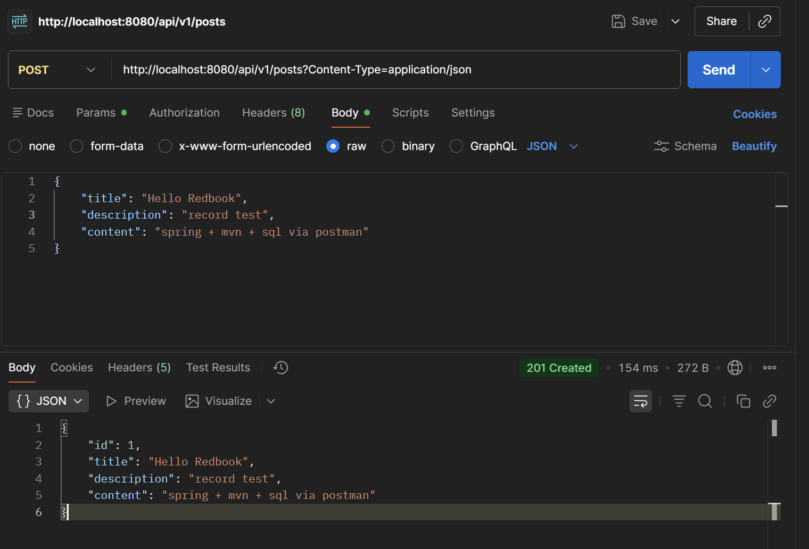
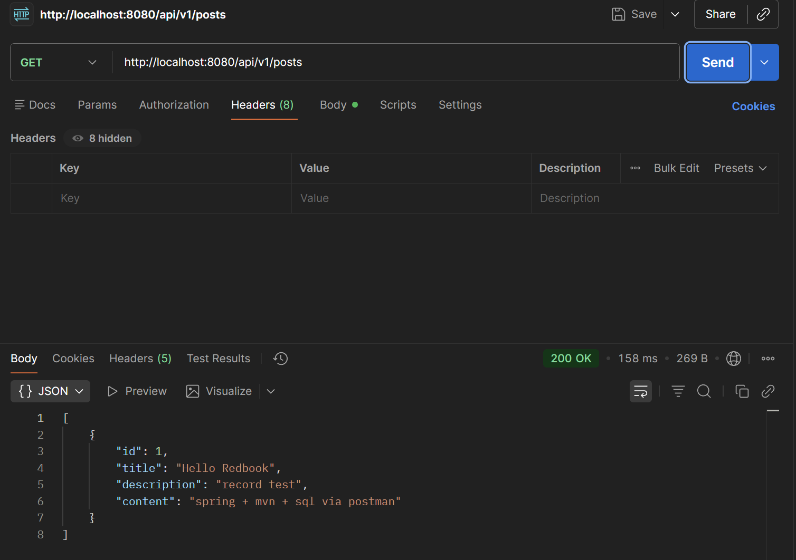

POST test

GET test


## Did you create the table POSTS in the database? if not, who did it for you? Can I change this behavior? (Hint: look at the application.properties file) ##
No.

In application.properties
```java
spring.jpa.hibernate.ddl-auto=update
```
Hibernate (the JPA implementation) generated the SQL and created the table.

This can be changed by setting .ddl-auto=
```txt
| Value         | Behavior                                   | Typical use                  |
| ------------- | ------------------------------------------ | ---------------------------- |
| `create`      | Drops tables and recreates them on startup | Local dev / demos            |
| `create-drop` | Create on start, drop on shutdown          | Tests                        |
| `update`      | Create missing tables, update columns      | Dev (what you’re using)      |
| `validate`    | Check schema only, fail if mismatch        | Prod                         |
| `none`        | Do nothing                                 | Prod (with Flyway/Liquibase) |

```

## Is your id in the database same as what you set in your request? why does this happen? (Hint: search the annotations used in your code) ##
No

```java
@Id
@GeneratedValue(strategy = GenerationType.IDENTITY)
private Long id;
```
In MySQL this maps to 
```sql
AUTO_INCREMENT
```
So MySQL decides the id, not myself.  
Even if I set id manually, Hibernate would ignore it.

Design reason
- Prevents ID collisions
- Prevents PK conflicts
- Ensures global uniqueness
- Keeps ORM state consistent
- Allows DB to optimize indexing