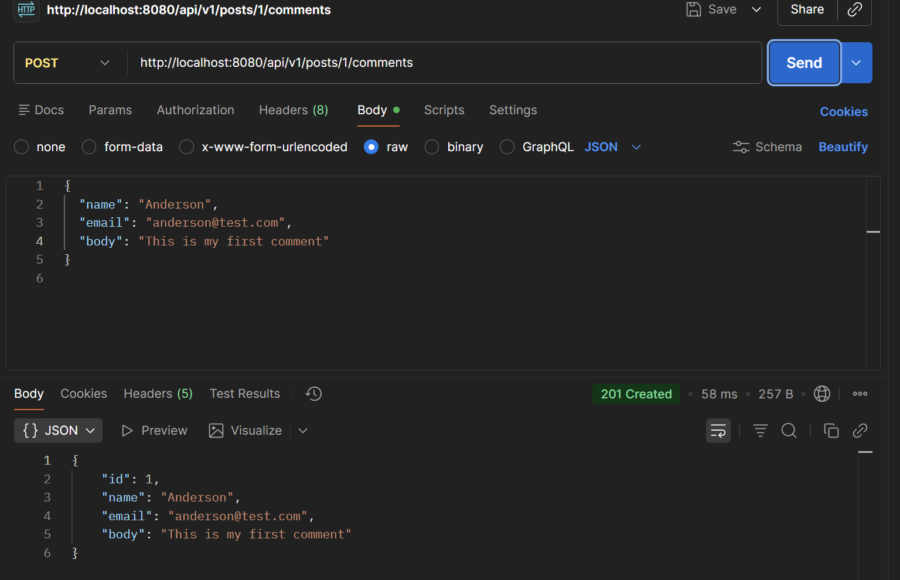

## 2. Type out the code for the Comment feature of the class project ##
```java
@Entity
@Table(name = "comments")
public class Comment {
    @Id
    @GeneratedValue(strategy = GenerationType.IDENTITY)
    private long id;

    @JsonProperty("name")
    private String name;
    private String email;
    private String body;

    @ManyToOne(fetch = FetchType.LAZY)
    @JoinColumn(name = "post_id", nullable = false)
    private Post post;

    @CreationTimestamp
    private LocalDateTime createDateTime;

    @UpdateTimestamp
    private LocalDateTime updateDateTime;

    public Post getPost() {
        return post;
    }

    public void setPost(Post post) {
        this.post = post;
    }

    public Comment() {
    }

    public Comment(long id, String name, String email, String body) {
        this.id = id;
        this.name = name;
        this.email = email;
        this.body = body;
    }

    public long getId() {
        return id;
    }

    public void setId(long id) {
        this.id = id;
    }

    public String getName() {
        return name;
    }

    public void setName(String name) {
        this.name = name;
    }

    public String getEmail() {
        return email;
    }

    public void setEmail(String email) {
        this.email = email;
    }

    public String getBody() {
        return body;
    }

    public void setBody(String body) {
        this.body = body;
    }

    public LocalDateTime getCreateDateTime() {
        return createDateTime;
    }

    public void setCreateDateTime(LocalDateTime createDateTime) {
        this.createDateTime = createDateTime;
    }

    public LocalDateTime getUpdateDateTime() {
        return updateDateTime;
    }

    public void setUpdateDateTime(LocalDateTime updateDateTime) {
        this.updateDateTime = updateDateTime;
    }

    @Override
    public String toString() {
        return "Comment{" +
                "id=" + id +
                ", name='" + name + '\'' +
                ", email='" + email + '\'' +
                ", body='" + body + '\'' +
                '}';
    }
}

```

## 3.In postman, call all of the APIs in PostController and CommentController. ##
PostController tested in hw8  
Below are CommentController test results via Postman



## 4. What is JPA? and what is Hibernate? ##
JPA(Java Persistence API) is a standard that defines how Java objects should be mapped to database tables(object-relational mapping ORM).  
- Map Java classes to database tables
- Map fields to columns
- Define insert, update, delete, query

Hibernate is a framework that implements JPA.
- Convert Java objects into SQL queries
- Executes SQL against the DB
- Handles caching, lazy loading, dirty checking, transactions

## 5.What is Hikari? what is the benefits of connection pool? ##
Hikari is a high-performance JDBC connection pool.   
Hikari manages and reuses database connections efficiently instead of creating a new connection for every request.

## 6.What is the @OneToMany, @ManyToOne, @ManyToMany ? write some examples.##
These are JPA relationship annotations that describe how tables are related and how Java objects reference each other.

### @ManyToOne ###
Many rows in one table belong to one row in another table.  
e.g. many orders belong to one user

```java
import javax.annotation.processing.Generated;

@Entity
public class Order {
    @Id
    @GeneratedValue
    private Long id;
    private double total;

    @ManyToOne
    @JoinColumn(name = "user_id")
    private User user;
}

@Entity
public class User {
    @Id
    @GeneratedValue
    private Long id;
    
    private String name;
}
```

### @OneToMany ###
One row in a table is associated with many rows in another table.  
e.g. A user has many orders.

```java
import java.util.ArrayList;

@Entity
public class User {
    @Id
    @GeneratedValue
    private Long id;
    private String name;

    @OneToMany(mappedBy = "user")  // The FK is controlled by user in Order
    private List<Order> orders = new ArrayList<>();
}

@Entity
public class Order {
    @Id 
    @GeneratedValue
    private Long id;
    private double total;
    
    @ManyToOne
    @JoinColumn(name = "user_id");  // FK column
    private User user;
}
```

### @ManyToMany ###
Many rows in table A relate to many rows in table B
e.g. students take courses

```java
@Entity
public class Student {

    @Id
    @GeneratedValue
    private Long id;

    private String name;

    @ManyToMany
    @JoinTable(
        name = "student_course",
        joinColumns = @JoinColumn(name = "student_id"),
        inverseJoinColumns = @JoinColumn(name = "course_id")
    )
    private Set<Course> courses = new HashSet<>();
}

@Entity
public class Course {

    @Id
    @GeneratedValue
    private Long id;

    private String title;

    @ManyToMany(mappedBy = "courses")
    private Set<Student> students = new HashSet<>();
}

```

## 7.What is the cascade = CascadeType.ALL, orphanRemoval = true ? and what are the other CascadeType and their features? In which situation we choose which one? ##
cascade means operations performed on the parent entity are automatically applied to the child entities.  
CascadeType.ALL includes:
- PERSIST
- MERGE
- REMOVE
- REFRESH
- DETACH

orphanRemoval deletes child entities when they are removed from the parent collection.  
- cascade reacts to parent operations
- orphanRemoval reacts to collection changes
```java
user.getOrders().remove(0);
```

## 8.What is the fetch = FetchType.LAZY, fetch = FetchType.EAGER ? what is the difference? In which situation you choose which one? ##
Fecth defines WHEN related entities are loaded from the database.
- FetchType.LAZY: related entities are loaded only when they are actually accessed.
- FetchType.EAGER: related entities are loaded immediately when the parent is loaded.

## 9.What is the rule of JPA naming convention? Shall we implement the method by ourselves? Could you list some examples? ##
Spring Data JPA can automatically generate SQL/JPQL queries based on repository method names, so in most cases we do NOT need to implement the method.  
examples
```java
public interface UserRepository extends JpaRepository<User, Long> {

    User findByEmail(String email);
    List<User> findByName(String name);
}

```

## 11. (Optional) Check out a new branch(https://github.com/TAIsRich/springboot-redbook/tree/hw02_01_jdbcTemplate) from branch 02_post_RUD, replace the dao layer using JdbcTemplate. ##
```java
// DAO interface
public interface PostDao {
    List<Post> findByTitle(String title);
    List<Post> findByTitleAndDescription(String title, String description);
}

// DAO Implementation w/ JDBCTemplate
@Repository
public class PostDaoImpl implements PostDao {
    private final JdbcTemplate jdbcTemplate;
    
    public PostDaoImpl(JdbcTemplate jdbcTemplate) {
        this.jdbcTemplate = jdbcTemplate;
    }
    
    @Override
    public List<Post> findByTitle(String title) {
        String sql = "SELECT * FROM posts WHERE title = ?";
        return jdbcTemplate.query(sql, (rs, rowNum) -> {
            Post post = new Post();
            post.setId(rs.getLong("id"));
            post.setTitle(rs.getString("title"));
            postsetDescription(rs.getString("description"));
            return post;
        }, title);
    }
    
    @Override
    public List<Post> findByTitleAndDescription(String title, String description) {
        String sql = "SELECT * FROM posts WHERE title = ? AND description = ?";
        eturn jdbcTemplate.query(sql, (rs, rowNum) -> {
            Post post = new Post();
            post.setId(rs.getLong("id"));
            post.setTitle(rs.getString("title"));
            postsetDescription(rs.getString("description"));
            return post;
        }, title);
    }
}
```

## 13.What is JPQL? ##
Java Persistence Query Language is an object-oriented query language defined by JPA.  
A database-independent query language that operates on entities and their fields, not on tables and columns.  

```SQL
SQL
SELECT * FROM posts WHERE title = "Hello World";

JPQL
SELECT p FROM Post p WHERE p.title = "Hello World";
```
- Post is entity name (a java class)
- title is java field, not real DB column

Pros
- Independent of DB vendor
- Avoid DB-specific SQL
- Work at object model level
- Navigate relationships naturally

## 14.What is @NamedQuery and @NamedQueries? ##
@NamedQuery and @NamedQueries are JPA annotations used to define static (predefined) JPQL queries that are named, reusable, and validated at startup. 

@NamedQuery defines a JPQL query with a name, usually attached to an entity class.
```java
@Entity
@NamedQuery(
        name = "User.findByEmail",
        query = "SELECT u FROM User u WHERE u.email = :email"
)
public class User {
    
    @Id 
    @GeneratedValue
    private Long id;
    private String email;
    private String name;
}

// usage
TypedQuery<User> query = 
    entityManager.createNamedQuery("User.findByEmail", User.class);

query.setParamter("email", "anderson@test.com");
User user = query.getSingleResult();
```

## 15.What is @Query? In which Interface we write the sql or JPQL? ##
@Query is a Spring Data JPA annotation used to define a custom query (JPQL or SQL) directly on a repository method.  
Write in Repository interface, not entity, not service, not controller.

```java
@Repository
public interface UserRespository extends JpaRepository<User, Long> {
    @Query("SELECT u FROM User u WHERE u.email = :email")
    User findUserByEmail(@Param("email") String email);
}
```

## 16.What is HQL and Criteria Queries? ##
HQL is Hibernate's object-oriented query language, similar to JPQL but Hibernate-specific.  
- Query entities rather tables
- Query fields rather columns
- Converted by Hibernate into SQL

Criteria Queries provide a type-safe, programmatic way to build queries using Java code instead of strings.
```java
CriteriaBuilder cb = em.getCriteriaBuilder();
CriteriaQuery<User> cq = cb.createQuery(User.class);

Root<User> user = cq.from(User.class);
cq.select(user)
  .where(cb.greaterThan(user.get("age"), 18));

List<User> result = em.createQuery(cq).getResultList();
```
- Type-safe
- Compile-time checking
- No string concatenation
- Dynamic query construction

## 17.What is EnityManager? ##
EntityManager is the core JPA interface that manages entity lifecycle, persistence context, and database operations.
- Manages entities
- Talks to the database
- Tracks changes (dirty checking)

What does it actually manage? 
### Persistence Context (1st-level cache) ###
Entity lifecycle
- new
- managed
- detached
- removed

## 18.What is SessionFactory and Session? ##
SessionFactory is a heavyweight, thread-safe object that creates session instances.

- create once per application
- thread-safe
- expensive to create
- holds: db conf, mapping metadata, second-level cache (if enabled)

Session represents a single unit of work with the database.
- NOT thread-safe
- Short-lived
- Wraps a JDBC connection
- Manages persistence context (1st-level cache), entity lifecycle, dirty checking

## 19.What is Transaction? how to manage your transaction? ##
A transaction is a sequence of database operations that must be executed as one atomic unit of work.

Transactions guarantee ACID:
- Atomicity: all or nothing
- Consistency: DB moves from one valid state to another
- Isolation: concurrent transactions dont interfere
- Durability: commited data survives crashes

Declarative Transaction Management
```java
@Service
public class OrderService {
    @Transactional
    public void placeOrder() {
        orderRepo.save(order);
        paymentRepo.save(payment);
    }
}
```

## 20.What is hibernate Caching? Explain Hibernate caching mechanism in detail. ##
Hibernate caching stores entity data in memory to avoid repeated database queries.

### 1st level Cache (Persistence Context Cache) ###
- Cache inside a Session/EntityManager
- Always enbaled
- Not configurable
- Scope: one transaction / one session
```java
User u1 = em.find(User.class, 1L);
User u2 = em.find(User.class, 1L);
```
SQL executed only once since second find() hits L1 cache.

### 2nd level Cache L2 ###
- cache shared across sessions
- optional need configuration
- stores entity state, not objects
```java
// Request 1
User u = em.find(User.class, 1L); // DB → L2 → L1

// Request 2 (different session)
User u = em.find(User.class, 1L); // L2 → L1 (no DB)

```

```text
Request
  ↓
L1 Cache (Session)
  ↓
L2 Cache (Shared)
  ↓
Database

```

to enable
```java
// global
spring.jpa.properties.hibernate.cache.use_second_level_cache=true
spring.jpa.properties.hibernate.cache.region.factory_class=org.hibernate.cache.ehcache.EhCacheRegionFactory

// per entity
@Entity
@Cacheable
@org.hibernate.annotations.Cache(
        usage = CacheConcurrencyStrategy.READ_WRITE
)
public class User {
    @Id
    private Long id;
}

```

### 3rd level Cache ###
- Cache query result ID, not entity data itself
- Depends on L2 cache

```java
List<User> users = em.createQuery(
    "SELECT u FROM User u WHERE u.status = 'ACTIVE'",
    User.class
)
.setHint("org.hibernate.cacheable", true)
.getResultList();

// result entites still loaded from L2
```

## 21.What is the difference between first-level cache and second-level cache? ##
L1: Session/EntityManager-scoped, always on, not shared;  
L2: Application-scoped, optional, shared across sessions.  
Details explained in last question.

## 22.How do you understand @Transactional? ##
Defines a transaction boundary.  
Sprint ensures that all database operations inside the method execute as a single transaction.

